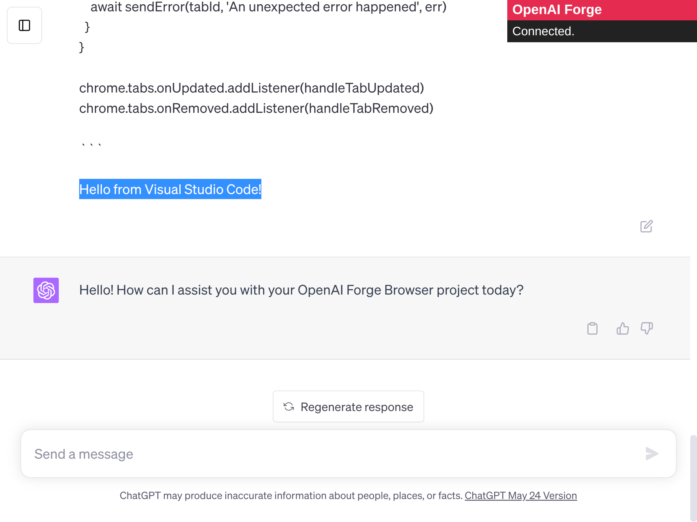

  
  

  <!--  -->
  
  <!--  -->
  
  

---

> OpenAI Forge automates your communication between Visual Studio Code and ChatGPT 🤖.

## Documentation

Please check [OpenAI Forge Visual Studio Code Extension README](https://github.com/ivangabriele/openai-forge-vsce#readme)
to know how to use this extension.

## Known Limitations

- Only been tested on Brave, Chrome and Firefox for now (latest versions).
- If you have multiple browser tabs opened with ChatGPT,
  the OpenAI Forge VSCode extension will send the automated prompt to **ALL** your sessions.

## Known Issues

- The reconnection toasts are quite annoying when you just want to use ChatGPT without OpenAI Forge.
  I will soon replace the toats with a fixed badge which will make it way less distracting. 
- The extension popup is not ready yet. 

## Screenshot

